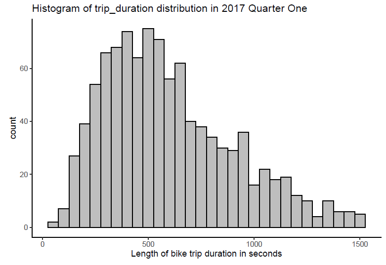
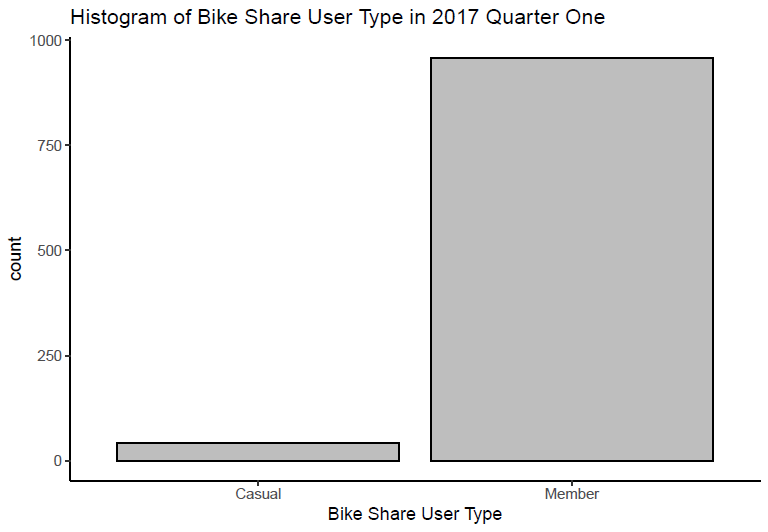
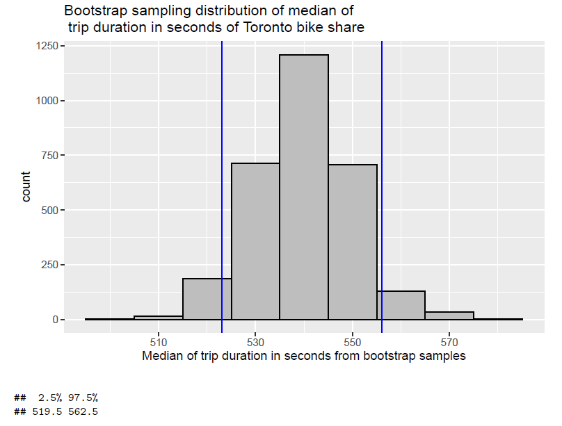
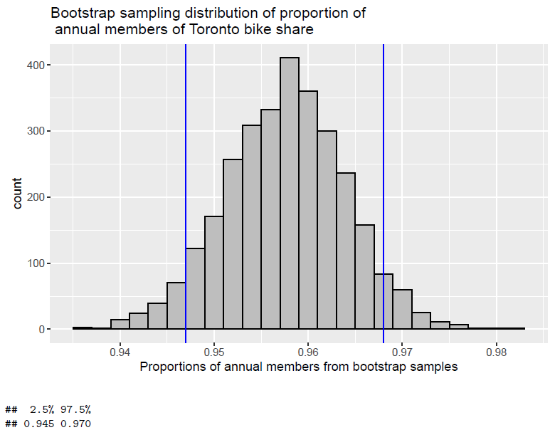

# Optimizing Bike-Share Pricing in Toronto

# Introduction

With every growing concern of climate change, many cities around the world are shifting their focus to
developing eco-friendly and sustainable communities. One of these goals is to lower the emission of carbon
dioxide, as per the Paris agreement aims to achieve. In an effort to decrease the number of citizens driving
cars on the road, Toronto has implemented a community bike-share system. An individual is able to use
the bike share as a member (paying an annual membership of 99 CAD) or as a casual member (paying 3.25
CAD per ride). Pricing mechanisms are a very good way to change community behavior. As we want to
promote more usage of these bike shares, data on the usage of these bikes will help policymakers decide on
the best pricing mechanism to promote sustainability, while still gaining enough profit for the system to be
self-maintaining.

The dataset we will be using in our analysis today is the Bike Share Toronto Ridership Data from 2017
Quarter 1. In the dataset, there are two variables per user. First, there is trip duration which is the length
of the bike ride in seconds. Secondly, there is user type; this is either member or casual. Members have
annual memberships. Casual users pay per ride.

We are interested in two questions. One, we want to find out how long the average bike-share user rides their
bike. Two, we want to find out the proportion of annual member users among the bike share community.
Answering these questions through analysis is important in optimizing the pricing mechanism for the bike
share system. In the current system, a casual user can ride a bike once for 3.25 CAD for 30 minutes, and
annual users can ride unlimited 30 minutes bike rides all year round. (bikesharetoronto.com) We infer from
our common knowledge that it is likely that annual members ride bikes more often than casual members.
Thus, ideally, to promote the use of the bike share and lower carbon emissions, we want to see a high
proportion of annual members among bike-share users. However, suppose we find from our Question 2
analysis that the proportion of annual members is actually quite low. Then policymakers will be able to
consider perhaps lowering the cost of the annual membership or increasing the cost per ride for casual
members, to incentivize more people to sign up. As you can see, the results from our analysis can directly
lead to a more educated recommendation of the pricing mechanism for the bike share, which is very important
and exciting knowledge for policymakers.

Providing some context, price mechanisms exist in almost every aspect of our lives. It is involved in everything
we purchase and interact with on a daily basis. In our markets driven by capitalism and efficiency, it is difficult
for sustainable initiatives to win over consumers over their less sustainable counterparts. From our failed
attempts at halting climate change, we all know that believing in the good nature and will of people is not
enough. Thus, it is critical for sustainable products and initiatives to be just as attractive as their substitutes
to be adopted by consumers. Obtaining and executing the most optimal commodity price for sustainable
goods is an issue with large global relevance and necessity. Optimal price systems can only be achieved by
observing community behavior and reaction. This is where data analysis becomes a very powerful tool in
figuring out the behavior of the masses and whether or not changes need to be made to get the best results.
Before we get started, let us introduce some terminology. Let us distinguish between a population and
a sample. A population is an entire group that we would like to draw conclusions about.  A
sample is a specific group that we have collected data from. Thus, the sample is always a
subset of the population. The dataset we are working with today is a sample and is not representative of
the population data. This means that the statistics that we extract from our dataset are called sample
statistics, such as the sample mean or sample median. Let’s also go over confidence intervals. A confidence
interval gives an estimated range of values that is likely to include an unknown population parameter, the
estimated range being calculated from a given set of sample data. We will be using bootstrap
analysis to produce these confidence intervals. An explanation of bootstrapping will be covered in the section
METHODS.

We will be analyzing two variables, trip duration in seconds and the proportion of annual members. We
hypothesize that the mean/median (whichever we decide to use) for the trip duration will be about 550
seconds (10 minutes) and that due to the high quality of our data we will be able to get a 95% confidence
interval with a very small interval for the estimation of our population mean/median for trip duration. We
also hypothesize that the proportion of annual members will be quite high (higher than casual members); as
the annual fee for membership is quite low. In addition to that, we also are hopeful that the 95% confidence
interval produced for the proportion of annual members will also have a small interval.

Our data analysis report will be structured as follows. The DATA section will include a description of the
data collection and cleaning process, a description of the important variables we will use in our analysis,
some numerical summaries of our dataset, and some helpful graphical displays of the data we are working
with. The METHODS section will include an explanation of bootstrap sampling and the type we have
used in this analysis, some clarifications on confidence intervals and our parameters of interest, as well as
a detailed outline of our bootstrap analysis. The RESULTS section will include the results of our two
bootstrap sampling analyses as well as its produced confidence intervals. Each will be accompanied by some
explanation of the results and their interpretation. The CONCLUSIONS section will include some refreshers
on our findings and conclusions from our results, some consideration of the drawbacks and limitations of our
analysis, and some recommendations for future steps to go beyond our analysis.

# Data
We will be using the Bike Share Toronto Ridership Data from 2017 Quarter 1. This dataset was obtained
from the opendatatoronto R package. No external data collection was necessary.

Before we start the analysis we did a little bit of data cleaning. First, we loaded the dataset from the
opendatatoronto R package. Secondly, we subsetted the dataset to contain the rider_id, trip duration and
user type. Thirdly, we renamed the column names of the dataset to more intuitive headers. Fourth, we
checked if there were any NA values in the dataset. We found that there were no NA’s so no missing value
cleaning was necessary. Fifthly, we saw that there was an extremely long almost invisible thin tail at the
upper end of our data in trip duration. So we decided to remove the outliers that satisfied the IQR criterion
using the boxplot.stats() function. Lastly, we realized that the original number of observations in the
sample was 127579, which would be very tedious to go through as there are a lot of observations. So we
decided to take a random sample of 1000 observations from our original dataset, so it is easier to work with.

Here is a detailed outline of the important variables in the dataset. (rider_id is the unique identifier for each
observation) 
1. Trip duration: The user’s bike ride length in seconds. Numeric continuous variable. Integer
data type. 
2. User type: The membership type of the user, either “Member” for annual member or “Casual”
for casual member. Categorical nominal variable. String data type.
Here is a glimpse of the dataset, for a better understanding.

```
Rows: 1,000
Columns: 3
$ rider_id <int> 839156, 842723, 725738, 798191, 852178, 757631, 72242...
$ trip_duration <int> 1107, 777, 526, 734, 232, 755, 398, 1265, 856, 509, 4...
$ user_type <chr> "Member", "Member", "Member", "Member", "Member", "Me...
```
Here are the summary statistics for our dataset:

```
sample_statistics values
1 Mean of trip_duration (sec) 598.783
2 Median of trip_duration (sec) 539
3 Max of trip_duration (sec) 1511
4 Min of trip_duration (sec) 70
5 Proportion of casual members 0.042
6 Proportion of annual members 0.958
```
```
trip_duration_quantiles
0% 70.00
25% 365.50
50% 539.00
75% 783.25
100% 1511.00
```
Our output above shows some of the summary statistics for the respective dataset. We observed that the
sample mean for trip duration is around 598 seconds, which is about 10 minutes. We interpret that the
average bike-share user rides for 10 minutes per trip. Taking a look at the spread of our data, we can
see that the trip duration ranges from a minimum of 70 seconds to a maximum of 1511 seconds (around
25 minutes). From this sample statistic, we can see that the length of bike rides can vary a lot in length
depending on the user. From our quantile output, we can see that the value for the 50% quantile is less
than the sample mean, this means that it is likely that the distribution of this dataset is skewed to the right,
that is with data bunched on the left with a long tail stretched out on the right. To see whether this is the
case, we will produce a histogram for this sample after going over the sample statistics. But nonetheless,
from our summary statistics we predict that our trip duration data is right-skewed. We also observed that
the proportion of causal members in the bike share is around 0.04 and the proportion of annual members is
around 0.96. This is very promising, as this likely means that most bike-share users are annual members,
and thus frequently use the bike share.

From our summary statistics, it would be worthwhile to investigate the distribution of our trip duration data.
Since this dataset only contains data for 2017 Quarter 1, it is only a sample of the population data. From
our summary statistics, we can see that the quality of our data is quite good, with many believable summary
statistics. Therefore, we can determine that this sample is a good candidate to conduct some bootstrap
analysis on; to get a better idea of what the population mean of trip duration and the true population
proportion of user type is. We will proceed with the bootstrapping analysis in later sections.

<p align="center">
  
</p>

The histogram above shows the distribution of trip durations for bike share users in 2017 Quarter one. We
can see from the histogram that the data does not follow a normal distribution, and is right-skewed. This
makes the data a good candidate for bootstrap analysis. Most traditional methods of statistical analysis
assume normal distribution or different distribution. (Frost) The great thing about bootstrap analysis is
that it does not assume anything about the distribution of the data, thus it is perfect for our dataset with
a right-skewed distribution. We can see from this histogram plot, that the mean does not seem to be a very
good representation of the general behavior of the bike riders. Rather the median is a better sample statistic
to represent the most frequent length of bike rides among users. From our plot, we can see that bike rides
around 550 seconds are the most common. From our analysis here, we decided that we will proceed to use
the median as our parameter of interest for our bootstrap analysis.

<p align="center">
  
</p>

The bar plot above shows the number of casual bike share members and the number of annual bike share
members. We can observe from this graph that most of the bike share members are actually annual members
that pay a fee of 99 CAD per year. Looking at this plot one can interpret that with the current bike share
prices, the benefit of signing up for an annual membership is much higher than the cost of the membership.
This could mean that policymakers could raise the price of the annual membership fee without losing many
annual members. This will allow for better upkeep of the bike share, as there would be a potential increase
in profits. Taking another perspective, we see that the number of casual members is very low. This could
be interpreted that the 3.25 CAD per-ride fee for casual members is too high, thus causing potential casual
members to take other forms of transportation. This interpretation will raise a potential recommendation
for lowering the cost of per ride fees, to incentivize casual members to use the bike share more.

In our proceeding analysis, we will be conducting bootstrap analysis to estimate confidence intervals. We will
be estimating the CI of the median of the trip duration in seconds and the proportion of annual members.
For a nice look at the trip duration and proportion of annual member data, please look at the figures in the
sections above.

# Methods
Why bootstrap analysis? It is important to note that the dataset we are using is merely a sample from a larger population data. Ideally, we would like to figure out the medianof trip duration and proportion of annual members from the population data. However, we do not have
the population data at our disposal. Therefore, we opt for the bootstrap method. By using the bootstrap
distribution of point estimators we can produce confidence intervals for the parameter’s true value. It is also
important to note that we are using real-world data, and therefore the distribution of this data is unknown
to us, especially for the population data. By using the bootstrap method, we do not need to induce any
assumptions about the distribution of our data prior to analysis like other traditional statistics methods. It
is also noteworthy that we are using the bootstrap today because we want to find the confidence interval of
the median; the confidence interval for medians has been hard to work with in the past without bootstrap
analysis, as their sampling distributions are difficult to describe theoretically. In the following
sections, we will be producing the confidence intervals for the trip duration median and the proportion of
annual members using bootstrap analysis.

The basic goal of this method is to “make an
inference about an estimate (such as sample mean) for a population parameter (such as population mean)
using sample data. It is a resampling method by independently sampling with replacement from an existing
sample data with the same sample size n, and performing inference among these resampled data” This
may sound confusing but it is not so difficult when it is broken down into several steps.

Firstly, we start with a sample size of n from a population dataset. In our case, our population
dataset is trip duration and user type of the Toronto Bike Share system for all years and quarters it has
existed. The dataset we are using today is a sample of this population dataset; it is the Toronto Bike Share
Dataset for 2017 Quarter 1. And the sample size of our dataset is 1000.

Secondly, we draw many bootstrap samples of size n with replacement from the original sample. 
In our case, we drew 3000 bootstrap samples of size 1000 with replacement from our original Toronto Bike
Share 2017 Quarter One data.

Thirdly, for each bootstrap sample, calculate the bootstrap sample statistic. For our case, we
calculated the median of trip duration and the proportion of annual members.

Lastly, the distribution of the values of all of the bootstrap sample statistics is called the bootstrap sampling
distribution. We then obtain a confidence interval from the bootstrap sampling distribution for our
population parameter of interest.

Now that we know what bootstrap sampling is, let us get into the details of our data analysis. There are
several different methods to bootstrapping. Empirical bootstrapping is used when our population dataset is
an empirical distribution. An empirical distribution of data is simply the distribution of a realized
dataset. On the other hand, parametric bootstrapping assumes that the data comes from a known
distribution with unknown parameters. Since our dataset is empirical, and we do not know the
distribution of the population dataset or even the sample dataset, we will be using the empirical bootstrap
sampling method.

From our bootstrap sampling distribution, we will obtain a confidence interval for our parameter of interest.
For our data analysis, we will use a confidence interval of 95%. This means that for the produced 95%
confidence interval we will be able to estimate with 95% confidence that the unknown population parameter
of interest is a value in the range of the confidence interval. This will be one of the key results
in our data analysis as we are trying to obtain an appropriate estimate for the population median of trip
duration and the population proportion of annual members.

We will be conducting two bootstraps. One for trip duration in seconds; which is a numeric continuous
variable. Two for user type which is a binary categorical variable. The parameters of interest will be
different between the two bootstraps. For the trip duration bootstrap, our parameter of interest will be the
median of trip duration in seconds. We decided to use the median over the mean because from the DATA
section in our report, we notice that our data is right-skewed and that the median is a better representation
of consumer behavior than the mean. We are also able to use the median for our parameter of interest
because we are doing bootstrapping; using the median in other traditional statistical methods is difficult
since the sampling distribution of the median is hard to describe. For the user type bootstrap, our parameter
of interest is the proportion of annual members in the bike share system. A proportion refers to the fraction
of the total that possesses a certain attribute. So the proportion of annual members in the sample
is the fraction of the total number of observations in the sample that are of an annual member user type.

The specific components of our bootstrap sampling will be, an empirical bootstrapping method, with an
iteration number of 3000, our sample size is 1000 and we will be creating bootstrap samples with replacement.

We have selected our method for data analysis taking into account assumptions, variable types, and practical
rationale. The bootstrap method was deemed the best way to go about this data analysis because we only
have access to a sample of the population data. It would ideal to find the population parameters of interest by
investigating the population data, but conducting a bootstrap is the next best and most appropriate method
to estimate our population parameters. However, the bootstrap method does come with assumptions that
must be fulfilled. The bootstrap method assumes the following. One, the sample data must be selected
randomly. This has been fulfilled, evident in the DATA section. Two, each observation in the sample should
be independent of all other observations. We assume that this has been fulfilled, due to the fact that most
bike share users do not ride bikes together and thus are independent and identically distributed. Third, our
sample size should not be small. We are using a sample size of 1000, which is enough data that resampling
results are not unreliable. For the user type bootstrap, our parameter of interest was decided to be the
proportion of annual membership because the data is categorical and binary.

**All analysis for this section of the report was programmed using R version 4.0.2. And additional
R packages, opendatatoronto, tidyverse, dplyr.**

# Results
<p align="center">
  
</p>

In the output, we have shown a histogram bootstrap sampling distribution of the median of trip duration. In
a brief sense, we have plotted the 3000 bootstrap sample medians to find the bootstrap sampling distribution
of the median. The blue lines in the histogram represent our upper and lower limits. Our upper limit is
the 97.5 percent quantile. And the lower limit is the 2.5 percent quantile. This will be helpful in producing
our 95% confidence interval. Another noteworthy point is that our bootstrap sampling distribution looks
like it is normally distributed, which follows the theory expressed before, that the sampling distribution will
converge to the normal distribution unrelated to the underlying original data distribution, due to the central
limit theorem. (Frost) From our histogram, we can see that the median observations have been centered
around 540 seconds; which is around 9 minutes. From our confidence interval output, we find that the
boundaries for our quantiles are found at (519.5, 562.5) seconds. Therefore, we can say that if we do the
same experiment with the population data, the population median of the trip duration will be between 519.5
and 562.5 seconds with 95% confidence. If you recall that our original sample median for trip_duration was
539 seconds, since 539 seconds is in our confidence interval, we can say that the confidence interval is most
likely quite reasonable and appropriate.

<p align="center">
  
</p>

In the output, we have shown a histogram bootstrap sampling distribution of the proportion of annual
members in the bike share. In a brief sense, we have plotted the 3000 bootstrap sample proportions to
find the bootstrap sampling distribution of the proportion. The blue lines in the histogram represent our
upper and lower limits. Our upper limit is the 97.5 percent quantile. And the lower limit is the 2.5 percent
quantile. This will be helpful in producing out 95% confidence interval. Another noteworthy point is that
our bootstrap sampling distribution looks like it is normally distributed, for the same reason stated for the
graph above. This means we have done the bootstrap analysis correctly! From our histogram, we can see
that the proportion has been centered around 0.957. From our confidence interval output, we find that
the boundaries for our quantiles are found at (0.945, 0.970). Therefore, we can say that if we do the same
experiment with the population data, the population proportion of annual members will be between 0.945
and 0.970 with 95% confidence. If you recall that our original sample proportion for annual members was
0.958, since 0.958 is in our confidence interval, we can say that the confidence interval is most likely quite
reasonable and appropriate.

Additionally, to ensure that our analysis is appropriate, we check out assumptions. Firstly, the sample data
must be selected randomly, and thus the sample is representative of the population it was drawn from. This
has been fulfilled as evident in the data cleaning section. Secondly, each observation should be independent
of all other observations. We can see that our data does mostly likely fulfill this assumption. While there are
some cases where the trip duration is interdependent, such as if two people are going somewhere together, it
is safe to assume that most of the observations in our dataset are not dependent on each other. We can also
safely interpret that membership is most likely independent of each other. Lastly, we assume that the sample
size we use for bootstrapping is not small; as if it is resampling will be unreliable. The sample we used has

1000 observations which we deem is a large enough sample for accurate resampling. As our analysis fulfills
the underlying assumptions of bootstrapping, we are able to deem our results as appropriate and valid.

Hence, we conclude that from our analysis the bootstrapped 95% confidence interval found for the median
trip duration was 519.5 to 562.5 seconds. And that the bootstrapped 95% confidence interval found for the
proportion of annual membership was 0.945 to 0.970. Further implications of our results will be detailed in
the conclusion section below.

# Conclusions
We started out in this data analysis report with a hypothesis. With regards to trip duration, we hypothesized
that the median trip duration will be around 550 seconds (roughly 10 minutes) and that we will be able to
obtain a 95% confidence interval with a very small interval to estimate the population median. With regards
to the proportion of annual members, we hypothesized that the proportion will be quite high (higher than
casual members) and that we will be able to obtain a 95% confidence interval with a small interval.

We will briefly recap our method. Our data analysis uses the empirical bootstrap sampling method. Put
in simple terms, for a sample with size n, we draw many bootstrap samples of size n with replacement
from the sample. We then calculate a bootstrap sample statistic pertaining to our parameter of interest for
each bootstrap sample. We then obtain a confidence interval for our parameter of interest by plotting the
bootstrap sampling distribution. The obtained 95% confidence interval will equip us with an appropriate
estimate for the range of values that include the population parameter of interest with 95% confidence.

By executing our method, we obtained the following results. The bootstrap sampling distribution of the
median of trip duration followed a normal distribution. The 95% confidence interval came out to be (519.5,
562.5) seconds. Therefore, we can say that if we do the same experiment with the population data, the
population median of the trip duration will be between 519.5 and 562.5 seconds with 95% confidence. And
from going over the assumptions and checking our original sample median, we deemed the results reasonable
and appropriate.

The bootstrap sampling distribution of the proportion of annual members followed a normal distribution.
The 95% confidence interval came out to be (0.945, 0.970). Therefore, we can say that if we do the same
experiment with the population data, the population proportion of annual members will be between 0.945
and 0.970 with 95% confidence. And from going over the assumptions and checking our original sample
median, we deemed the results reasonable and appropriate.

From our results, we can see that our hypotheses were indeed correct. Our hypothesized median trip duration
value of 550 seconds is indeed in the 95% confidence interval and the 95% confidence interval has an upper
and lower bound that is only different by around 40 seconds. Looking at our results we can also see that
the proportion of annual members is indeed higher than the proportion of casual members. And the 95%
confidence interval is also very small with upper and lower bounds only apart by a value of around 0.025.

Relating back to the big picture of this analysis, by only using a sample of the population data we have been
able to estimate that in the Toronto bike share system, the population median of trip duration in seconds
is a value in the range of (519.5, 562.5) seconds with 95% confidence. With regards to new pricing options
for the bike exchange, the current price is 3.25 CAD for 30 minutes per ride. The newfound information
provides evidence that changing the price to 3.25 CAD for 20 minutes will most likely not affect Toronto
bike share revenues, or inconvenience many users of the bike share since the population median is around
10 minutes away from the new limit. This new pricing will potentially slightly increase revenues for the
system without largely impacting customer satisfaction. From our analysis, we were also able to estimate
with 95% confidence that the population proportion of annual members in the bike share system is a value
in the range of (0.945, 0.970). This result indicates that most consumers that use the bike share system are
annual members. Suggesting that many consumers find that the current 99 CAD per year pricing for the
bike share is a good deal; with high benefits than cost. This provides evidence that perhaps increasing the
annual membership fee will not greatly decrease the proportion of annual members in the bike share system,
and will help bring in more revenue for the bike share to make it more sustainable.

# Discussion and Limitations
Our data analysis has been fairly decent so far, however, we must point out some noteworthy limitations to
our methods and our interpretations. We have primarily used the bootstrapping method for our analysis,
which as mentioned in the methods section that we must assume that the sample we use resembles the
population it was drawn from sufficiently, this is so that resampling will enable us to estimate how a sample
statistic could vary. In our data analysis, we have assumed that we have fulfilled this requirement. However,
in reality, we do not have the population data and there is no way to check whether our sample is truly
a good representation of our population data. In a way, we are taking this assumption for granted, which
is a huge drawback of our data analysis. Another drawback is based on our interpretation of our analysis.
The main goal of this report has been to provide evidence for certain changes in the price mechanics of
the Toronto Bike Share system. While getting a strong estimation of the population median trip duration
and population proportion of annual membership is a very good starting point, our recommendations have
been based on these findings plus our personal speculation. In reality, it is not possible to predict how a
market will react to these price changes without actually implementing them and investigating them through
a method like instrumental variables, panel data analysis and etc. This is also another limitation of our data
analysis.

This brings us to the possible next steps for future analysis and reports. For future analysis, it would be
wonderful if we could implement the suggested price changes for the Toronto Bike Share system. What we
propose is a difference-in-difference method where the price changes will be enacted for a certain region and
unchanged for another region. By doing this we will be able to control for the time period changes, and still
compare the differences in consumer behavior as a result of the changes in price mechanisms. This would
be extremely interesting and if all goes well, the changes can be implemented to the entire Toronto Bike
Share system. For obvious reasons, conducting an experiment like this was beyond the capacity of our data
analysis report.
